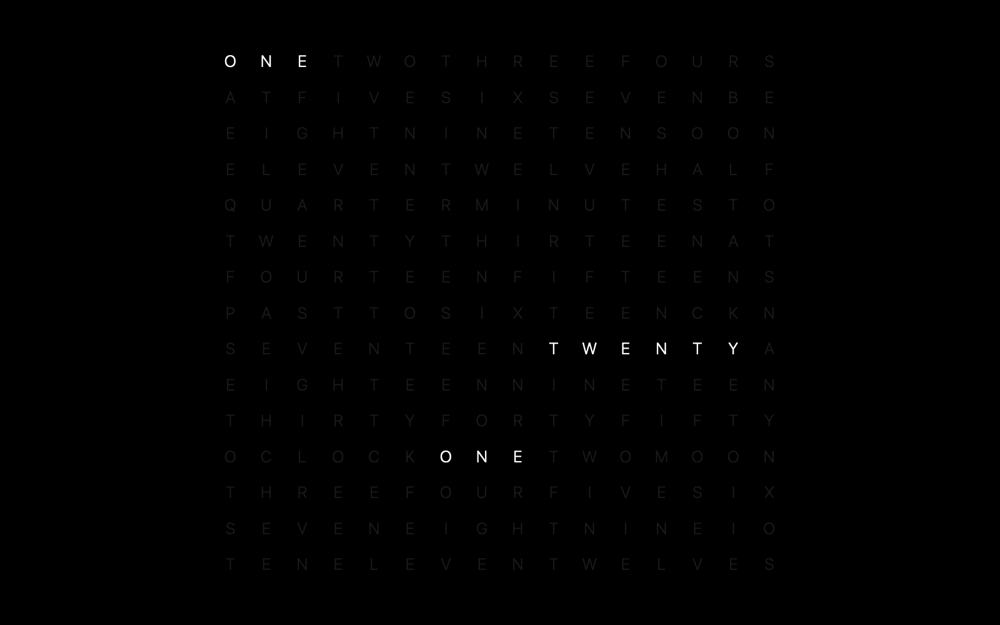

# Grid Clock

A word clock screensaver for macOS. The face is a 16 × 15 grid of letters; the
lit ones read out the time.



## About this fork

This is a fork of [chrstphrknwtn/grid-clock-screensaver](https://github.com/chrstphrknwtn/grid-clock-screensaver),
ported to modern macOS.

> **On licensing:** upstream carries no license at all, so this fork's MIT
> grant covers only what this fork wrote — not the clock's design, which is
> upstream's. Read [Licensing](#licensing) before depending on this.

Upstream (0.0.5, 2018) drew the clock as a local HTML page inside a `WebView` —
WebKit 1. That stopped working on macOS 14, which moved screensavers into the
sandboxed `legacyScreenSaver` host. The WebKit 1 API itself is not the problem:
it is still in the macOS 26 SDK, still links, and still renders the original
page correctly inside an ordinary app. It is the sandboxed screensaver host that
it no longer draws in.

So rather than swap in `WKWebView` and stay exposed to the same class of
problem, this fork replaces the web view with a native Core Text renderer. The
bundle now loads nothing at runtime — no HTML, no JavaScript, no web engine, no
file access.

The clock itself is unchanged. The port is checked against upstream's
`index.js` for all 1440 minutes of the day, and uses the same `#222` / `#fff`
colours and the same 400 ms crossfade.

## Requirements

macOS 14 (Sonoma) or later — the same set Apple still issues security updates
for. That floor is deliberate rather than technical: nothing here needs a modern
API, but macOS 14 is exactly where upstream broke, so on macOS 13 and earlier
you may as well run [the original](https://github.com/chrstphrknwtn/grid-clock-screensaver),
which works fine there.

Building needs Xcode. Verified on macOS 26.6 (Tahoe) with Xcode 26.6; 14 and 15
are declared but untested.

## Install

### From a release

```sh
curl -fsSL https://raw.githubusercontent.com/forkcloser/grid-clock-screensaver/main/install.sh | bash
```

The script downloads the latest release, verifies it, installs it into
`~/Library/Screen Savers`, and tells you where to find it in System Settings.
`--system` installs for all users, `--version vX.Y.Z` pins a release, and
`--help` lists the rest.

**What "verifies" means, and why it matters here.** The bundle is ad-hoc signed
— there is no Apple Developer ID behind it. That is enough for macOS to *load*
it (`legacyScreenSaver` carries
`com.apple.security.cs.disable-library-validation`, which is why an ad-hoc
signed plug-in loads into it at all), but not enough for Gatekeeper to run it
once it has arrived from the internet carrying a quarantine attribute. Clearing
that attribute is what makes a downloaded `.saver` work — and being told to run
`xattr -dr` on an unverified download is being asked to switch off a protection
on faith.

So the script earns the trust before it spends it:

1. **cosign** checks `checksums.txt` against the signature the release workflow
   produced. That signature is *keyless*: its identity is this repository's
   `release.yaml` at a `v*` tag, certified by Fulcio and recorded in Rekor.
   There is no key anywhere to be stolen, and a file signed by anything else
   fails this step.
2. The bundle's SHA-256 is checked against that now-trusted checksums file.
3. Only then is the archive expanded, de-quarantined, and installed — and the
   bundle's own code signature is re-verified afterwards, so an archive that
   damaged it in transit is caught instead of installed.

Step 1 needs [cosign](https://github.com/sigstore/cosign)
(`brew install cosign`). Without it the script stops rather than quietly
falling back to "checksum only", since a checksums file you cannot
authenticate proves nothing about who wrote it. `--allow-unverified` opts into
that downgrade explicitly.

To verify by hand instead:

```sh
cosign verify-blob --bundle checksums.txt.sigstore.json \
  --certificate-oidc-issuer https://token.actions.githubusercontent.com \
  --certificate-identity-regexp \
    'https://github.com/forkcloser/grid-clock-screensaver/\.github/workflows/release\.yaml@refs/tags/v.*' \
  checksums.txt
```

### From source

Building needs Xcode. Everything else is pinned — see [Development](#development).

```sh
git clone https://github.com/forkcloser/grid-clock-screensaver.git
cd grid-clock-screensaver
just install
```

Quit System Settings first (⌘Q — closing the window is not enough; it reads the
screensaver list once at launch).

`just install` builds and copies into `~/Library/Screen Savers`, which installs
for your user only. `just build` stops after the build; the bundle lands in
`build/Build/Products/Release/`. Without `just`, the same build is:

```sh
xcodebuild -project 'Grid Clock.xcodeproj' -scheme 'Grid Clock' \
           -configuration Release -destination 'generic/platform=macOS' \
           -derivedDataPath build build
```

`-destination 'generic/platform=macOS'` is what produces a universal
(arm64 + x86_64) binary. Without it you get one for your own architecture only.

### 3. Select it

**macOS 26 (Tahoe)** folded Screen Saver into the Wallpaper pane — there is no
longer a Screen Saver item in the System Settings sidebar:

1. System Settings → **Wallpaper**
2. Click **Screen Saver…** at the top right, next to *Clock Appearance…*
3. Scroll to the bottom. Grid Clock is in the last section, alongside
   **Message** — the two are shown by the same mechanism. Its thumbnail is
   near-black, so it is easy to skim past.

On **macOS 14 and 15**, Screen Saver is its own sidebar item instead; the saver
appears at the bottom of that list, under *Other*.

If it is not listed at all, you almost certainly installed it while System
Settings was running. Quit with ⌘Q and reopen.

## Options

With Grid Clock selected, **Options…** appears below the preview:

| Setting | Effect |
| --- | --- |
| Main display only *(default)* | Clock on the main display, other displays black |
| All displays | Clock on every display |

## Uninstall

```sh
just uninstall            # or, without just:
rm -rf ~/Library/'Screen Savers'/'Grid Clock.saver'
```

Preferences are stored per-host and are left behind. To clear them too:

```sh
defaults -currentHost delete com.chrstphrknwtn.grid-clock
rm -f ~/Library/Preferences/ByHost/com.chrstphrknwtn.grid-clock.*.plist
```

The second line is not redundant — `defaults delete` empties the file but leaves
it on disk.

## How it works

Every word the clock can say is a run of consecutive cells in the grid, so
`GridClock.m` is a letter table, a table of `(offset, length)` spans, and the
rules that pick which spans to light for a given hour and minute.

Drawing is Core Text. A cell is only ever unlit, lighting up, going dark, or
lit, and they all turn over on the same minute boundary — so a frame is at most
four `CTFontDrawGlyphs` calls, one per colour. Nothing is redrawn between
transitions.

Type is the system font at a size proportional to the grid cell, so the face
scales cleanly from the System Settings thumbnail up to a 6K display.

## Differences from upstream

Behaviour is otherwise identical to 0.0.5.

- **Font sizing.** Upstream sized type in viewport units and carried a media
  query specifically to stop the System Settings thumbnail from breaking.
  Sizing off the cell handles that case, so both are gone.
- **Display options.** "Last focused screen" has been dropped. macOS 14 and
  later run a separate saver process per display, which leaves nothing coherent
  for it to mean. An existing *all screens* preference migrates across; *last
  focused* becomes *main display only*.
- **Removed.** `Webview/` and `ConfigureSheet.xib`. The options sheet is built
  in code — the xib was loaded with `+[NSBundle loadNibNamed:owner:]`,
  deprecated since macOS 10.8.
- **Project file rebuilt.** Modern object version, current warning set (the
  build is warning-clean under it), separate Debug and Release settings that
  actually differ, universal `ARCHS`, hardened runtime, and a checked-in shared
  scheme so `xcodebuild -scheme` works straight from a clone. `Info.plist` is
  gone — it is generated from build settings now.

## Development

The repository follows [limen](https://github.com/farcloser/limen), so the
tooling is pinned and the commands are the same ones CI runs:

```sh
just            # lint
just test       # parity + bundle tests
just build      # the .saver, into build/Build/Products/Release/
just --list     # everything else
```

Xcode is the one exception to the pinning: `xcodebuild` and `clang` come from
the system toolchain, because aqua cannot pin them. Everything else — `just`,
`shellcheck`, `yamlfmt`, `goreleaser`, `cosign`, `limen` itself — is pinned in
`aqua.yaml` and checksum-verified.

**Tests.** `just test-parity` compiles `GridClock.m` into a harness and checks
what the clock says for all 1440 minutes of the day against `test/golden.txt`,
which was generated from upstream 0.0.5's own `Webview/index.js` — see
`test/regenerate-golden.js`, which reads that file straight out of git history.
`just test-bundle` builds the `.saver`, loads it the way the screensaver host
does (`NSBundle` → `principalClass`), renders a frame offscreen, and checks it
looks like a lit grid on black.

**Releases** are cut with `just do release vX.Y.Z`: it verifies a clean tree,
creates a *signed* tag, and pushes it. The tag push is the release button — the
workflow builds on a macOS runner, signs `checksums.txt` with keyless cosign,
and publishes the GitHub release.

## Licensing

**This fork's own work is [MIT](./LICENSE). Upstream's is not licensed at all,
and this fork cannot fix that.**

[chrstphrknwtn/grid-clock-screensaver](https://github.com/chrstphrknwtn/grid-clock-screensaver)
carries no `LICENSE` file and no license metadata. That is not a technicality:
absent a license, the default is that no rights are granted, and it has been
asked about upstream in
[issue #12](https://github.com/chrstphrknwtn/grid-clock-screensaver/issues/12)
("Question Regarding Open Source License", opened November 2024) — **still
unanswered**.

So, to be exact about what the MIT grant here does and does not cover:

- **It covers what this fork wrote** — the Core Text renderer, the port of the
  time-to-cells rules into C, the configure sheet, the project file, the tests,
  the tooling, and this documentation.
- **It does not, and cannot, cover upstream's work.** The letter grid, the
  vocabulary of the clock face, the `#222`/`#fff` palette, the 400 ms
  crossfade, and the rules for which words light at which minute are
  Christopher Newton's design. This fork reimplemented them; it did not
  originate them, and it has no standing to license them to you. The parity
  test in `test/` exists precisely because the behaviour is upstream's — it
  measures the fidelity of the reimplementation, and in doing so documents the
  debt.

We are not claiming rights we do not hold. If you need certainty about the
upstream portion, the answer has to come from upstream. If you are Christopher
Newton and would like this fork changed — relicensed, attributed differently,
or taken down — open an issue and it will be done.

## Related

- [Epoch Flip Clock Screensaver](https://github.com/chrstphrknwtn/epoch-flip-clock-screensaver)
- [Word Clock Screensaver](https://github.com/chrstphrknwtn/word-clock-screensaver)
